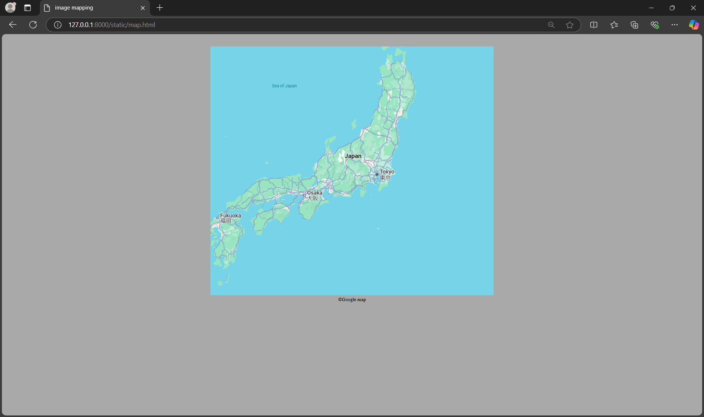

# Ex04 Places Around Me
# Date: 09/11/2024
# AIM
To develop a website to display details about the places around my house.

# DESIGN STEPS
## STEP 1
Create a Django admin interface.

## STEP 2
Download your city map from Google.

## STEP 3
Using <map> tag name the map.

## STEP 4
Create clickable regions in the image using <area> tag.

## STEP 5
Write HTML programs for all the regions identified.

## STEP 6
Execute the programs and publish them.

# CODE
```
map.html

<!DOCTYPE html>
<html lang="en">
<head>
    <meta charset="UTF-8">
    <meta name="viewport" content="width=device-width, initial-scale=1.0">
    <title>image mapping</title>
</head>
<style>
    body {
        background-color: darkgray;

    }
</style>
<body>
    
 <center>
    <h1 style="font-family: Impact, Haettenschweiler, 'Arial Narrow Bold', sans-serif;"></h1><br>

<map name="image-map">
    <area target="tokyo" alt="tokyo" title="tokyo" href="tokyo.html" coords="506,382,555,352,599,326,600,420,577,453,551,476,531,437,447,497,399,445" shape="poly"></area>
    <area target="osaka" alt="osaka" title="osaka" href="okasa.html" coords="342,427,379,504,325,573,292,545,249,435,280,419" shape="poly"></area>
    <area target="fukuoka" alt="fukuoka" title="fukuoka" href="fukuoka.html" coords="0,571,62,533,95,575,103,616,78,713,51,725,11,712" shape="poly"></area>
    <area target="japan" alt="japan" title="japan" href="japan.html" coords="349,383,362,453,603,308,532,255" shape="poly"></area>
</map>
</body>
<footer>
    &copy;Google map
</footer>
</center>
</html>

japan.html

<!DOCTYPE html>
<html lang="en">
<head>
    <meta charset="UTF-8">
    <meta name="viewport" content="width=device-width, initial-scale=1.0">
    <meta http-equiv="X-UA-Compatible" content="ie=edge">
    <title>Welcome to Japan</title>
    <style>
        body {
            font-family: Arial, sans-serif;
            margin: 0;
            padding: 0;
            background-color: #f0f8ff;
            color: #333;
        }
        header {
            background-color: #003366;
            color: white;
            padding: 20px 0;
            text-align: center;
        }
        h1 {
            font-size: 3em;
        }
        .container {
            padding: 20px;
        }
        .section-title {
            font-size: 2em;
            color: #003366;
            margin-bottom: 20px;
        }
        .images-container {
            display: flex;
            justify-content: space-around;
            margin-top: 20px;
        }
        .images-container img {
            width: 300px;
            height: auto;
            border-radius: 8px;
            box-shadow: 0px 4px 6px rgba(0, 0, 0, 0.1);
        }
        .footer {
            background-color: #003366;
            color: white;
            text-align: center;
            padding: 10px 0;
            position: absolute;
            width: 100%;
            bottom: 0;
        }
        .footer p {
            margin: 0;
        }
        .btn {
            background-color: #28a745;
            color: white;
            padding: 10px 20px;
            font-size: 1.2em;
            border: none;
            border-radius: 5px;
            cursor: pointer;
            text-decoration: none;
        }
        .btn:hover {
            background-color: #218838;
        }
    </style>
</head>
<body>

<header>
    <h1>Welcome to Japan!</h1>
    <p>Your adventure starts here</p>
</header>

<div class="container">
    <h2 class="section-title">Explore the Beauty of Japan</h2>
    <p>Japan is known for its rich culture, breathtaking landscapes, and advanced technology. Whether you're visiting historical landmarks, enjoying beautiful cherry blossoms, or savoring delicious cuisine, Japan offers something for everyone.</p>
    
    <div class="images-container">
        
    </div>

    <h2 class="section-title">Things to Do in Japan</h2>
    <ul>
        <li>Visit Tokyo's Shibuya Crossing</li>
        <li>Take a bullet train ride</li>
        <li>Explore Kyoto's temples and shrines</li>
        <li>Enjoy a sushi-making workshop</li>
        <li>Relax in an onsen (hot spring)</li>
    </ul>
</div>
</body>
</html>

tokyo.html
<!DOCTYPE html>
<html lang="en">
<head>
    <meta charset="UTF-8">
    <meta name="viewport" content="width=device-width, initial-scale=1.0">
    <meta http-equiv="X-UA-Compatible" content="ie=edge">
    <title>Welcome to Tokyo</title>
    <style>
        body {
            font-family: Arial, sans-serif;
            margin: 0;
            padding: 0;
            background-color: #f9f9f9;
            color: #333;
        }
        header {
            background-color: #1c1c1c;
            color: white;
            text-align: center;
            padding: 40px 20px;
        }
        h1 {
            font-size: 3.5em;
            margin: 0;
        }
        p {
            font-size: 1.2em;
            margin-top: 10px;
        }
        .container {
            padding: 40px;
        }
        .section-title {
            font-size: 2.5em;
            color: #2c3e50;
            margin-bottom: 20px;
        }
        .images-container {
            display: flex;
            justify-content: space-around;
            flex-wrap: wrap;
            margin-top: 20px;
        }
        .images-container img {
            width: 300px;
            height: auto;
            border-radius: 8px;
            box-shadow: 0px 4px 6px rgba(0, 0, 0, 0.1);
            margin: 10px;
        }
        .content {
            line-height: 1.8;
            font-size: 1.1em;
            color: #555;
        }
        .btn {
            background-color: #e74c3c;
            color: white;
            padding: 12px 24px;
            font-size: 1.2em;
            border: none;
            border-radius: 5px;
            cursor: pointer;
            text-decoration: none;
            display: inline-block;
            margin-top: 20px;
        }
        .btn:hover {
            background-color: #c0392b;
        }
        .footer {
            background-color: #1c1c1c;
            color: white;
            text-align: center;
            padding: 10px 20px;
            position: fixed;
            width: 100%;
            bottom: 0;
        }
        .footer p {
            margin: 0;
        }
    </style>
</head>
<body>

<header>
    <h1>Welcome to Tokyo!</h1>
    <p>The heart of Japan, where tradition meets innovation</p>
</header>

<div class="container">
    <h2 class="section-title">Explore the Wonders of Tokyo</h2>
    <p class="content">Tokyo, the vibrant capital of Japan, is a city like no other. From the bustling streets of Shibuya to the peaceful gardens of the Imperial Palace, Tokyo offers a perfect balance of old and new. Whether you are into cutting-edge technology, historical landmarks, or world-class food, Tokyo has it all!</p>
    
    <div class="images-container">
        
    </div>

    <h2 class="section-title">Top Attractions in Tokyo</h2>
    <ul class="content">
        <li>Tokyo Tower - The iconic landmark offering stunning city views</li>
        <li>Shibuya Crossing - Famous for its hustle and bustle, a true symbol of Tokyo</li>
        <li>Senso-ji Temple - Tokyo's oldest temple located in Asakusa</li>
        <li>Akihabara - A paradise for tech lovers and anime fans</li>
        <li>Meiji Shrine - A tranquil shrine surrounded by lush greenery</li>
        <li>Odaiba - A futuristic entertainment hub on Tokyo Bay</li>
    </ul>
</div>

</body>
</html>

fukuoka.html

<!DOCTYPE html>
<html lang="en">
<head>
    <meta charset="UTF-8">
    <meta name="viewport" content="width=device-width, initial-scale=1.0">
    <meta http-equiv="X-UA-Compatible" content="ie=edge">
    <title>Welcome to Fukuoka</title>
    <style>
        body {
            font-family: Arial, sans-serif;
            margin: 0;
            padding: 0;
            background-color: #f4f4f4;
            color: #333;
        }
        header {
            background-color: #1a5276;
            color: white;
            text-align: center;
            padding: 40px 20px;
        }
        h1 {
            font-size: 3.5em;
            margin: 0;
        }
        p {
            font-size: 1.2em;
            margin-top: 10px;
        }
        .container {
            padding: 40px;
        }
        .section-title {
            font-size: 2.5em;
            color: #2c3e50;
            margin-bottom: 20px;
        }
        .images-container {
            display: flex;
            justify-content: space-around;
            flex-wrap: wrap;
            margin-top: 20px;
        }
        .images-container img {
            width: 300px;
            height: auto;
            border-radius: 8px;
            box-shadow: 0px 4px 6px rgba(0, 0, 0, 0.1);
            margin: 10px;
        }
        .content {
            line-height: 1.8;
            font-size: 1.1em;
            color: #555;
        }
        .btn {
            background-color: #e67e22;
            color: white;
            padding: 12px 24px;
            font-size: 1.2em;
            border: none;
            border-radius: 5px;
            cursor: pointer;
            text-decoration: none;
            display: inline-block;
            margin-top: 20px;
        }
        .btn:hover {
            background-color: #d35400;
        }
        .footer {
            background-color: #1a5276;
            color: white;
            text-align: center;
            padding: 10px 20px;
            position: fixed;
            width: 100%;
            bottom: 0;
        }
        .footer p {
            margin: 0;
        }
    </style>
</head>
<body>

<header>
    <h1>Welcome to Fukuoka!</h1>
    <p>Discover the charming city of Fukuoka, Japan</p>
</header>

<div class="container">
    <h2 class="section-title">Explore Fukuoka</h2>
    <p class="content">Fukuoka is a vibrant city located on the northern shore of Kyushu, Japan’s southernmost island. Known for its rich history, delicious food, and stunning landscapes, Fukuoka offers the perfect blend of traditional and modern attractions. Whether you’re visiting for its beaches, temples, or shopping districts, Fukuoka has something for everyone.</p>
    
    <div class="images-container">
        
    </div>

    <h2 class="section-title">Top Attractions in Fukuoka</h2>
    <ul class="content">
        <li>Ohori Park - A tranquil park with a beautiful large pond</li>
        <li>Fukuoka Tower - The tallest seaside tower in Japan, offering stunning views of the city</li>
        <li>Canal City Hakata - A large shopping complex with a canal running through it</li>
        <li>Hakata Gion Yamakasa - The city's famous annual festival featuring impressive floats</li>
        <li>Kushida Shrine - A historical shrine that dates back to the 8th century</li>
        <li>Momochi Seaside Park - A scenic coastal area perfect for relaxation</li>
    </ul>
</div>


</body>
</html>

osaka.html

<!DOCTYPE html>
<html lang="en">
<head>
    <meta charset="UTF-8">
    <meta name="viewport" content="width=device-width, initial-scale=1.0">
    <meta http-equiv="X-UA-Compatible" content="ie=edge">
    <title>Welcome to Osaka</title>
    <style>
        body {
            font-family: Arial, sans-serif;
            margin: 0;
            padding: 0;
            background-color: #f7f7f7;
            color: #333;
        }
        header {
            background-color: #2d3e50;
            color: white;
            text-align: center;
            padding: 40px 20px;
        }
        h1 {
            font-size: 3.5em;
            margin: 0;
        }
        p {
            font-size: 1.2em;
            margin-top: 10px;
        }
        .container {
            padding: 40px;
        }
        .section-title {
            font-size: 2.5em;
            color: #2c3e50;
            margin-bottom: 20px;
        }
        .images-container {
            display: flex;
            justify-content: space-around;
            flex-wrap: wrap;
            margin-top: 20px;
        }
        .images-container img {
            width: 300px;
            height: auto;
            border-radius: 8px;
            box-shadow: 0px 4px 6px rgba(0, 0, 0, 0.1);
            margin: 10px;
        }
        .content {
            line-height: 1.8;
            font-size: 1.1em;
            color: #555;
        }
        .btn {
            background-color: #e67e22;
            color: white;
            padding: 12px 24px;
            font-size: 1.2em;
            border: none;
            border-radius: 5px;
            cursor: pointer;
            text-decoration: none;
            display: inline-block;
            margin-top: 20px;
        }
        .btn:hover {
            background-color: #d35400;
        }
        .footer {
            background-color: #2d3e50;
            color: white;
            text-align: center;
            padding: 10px 20px;
            position: fixed;
            width: 100%;
            bottom: 0;
        }
        .footer p {
            margin: 0;
        }
    </style>
</head>
<body>

<header>
    <h1>Welcome to Osaka!</h1>
    <p>Explore the city of fun, food, and culture</p>
</header>

<div class="container">
    <h2 class="section-title">Discover Osaka</h2>
    <p class="content">Osaka is one of Japan's most exciting cities, offering an unforgettable blend of history, modernity, and delicious food. Known for its lively street culture, remarkable architecture, and warm-hearted people, Osaka promises to make your visit unforgettable.</p>
    
    <div class="images-container">
        
    </div>

    <h2 class="section-title">Top Attractions in Osaka</h2>
    <ul class="content">
        <li>Osaka Castle - A stunning historic landmark and museum</li>
        <li>Dotombori - A vibrant district known for street food and neon lights</li>
        <li>Universal Studios Japan - A world-famous theme park with thrilling rides</li>
        <li>Shitenno-ji Temple - Japan's oldest Buddhist temple</li>
        <li>Umeda Sky Building - A unique skyscraper offering panoramic city views</li>
        <li>Osaka Aquarium Kaiyukan - One of the largest and most spectacular aquariums in the world</li>
    </ul>

    
</div>


</body>
</html>

```
# OUTPUT



# RESULT
The program for implementing image maps using HTML is executed successfully.
